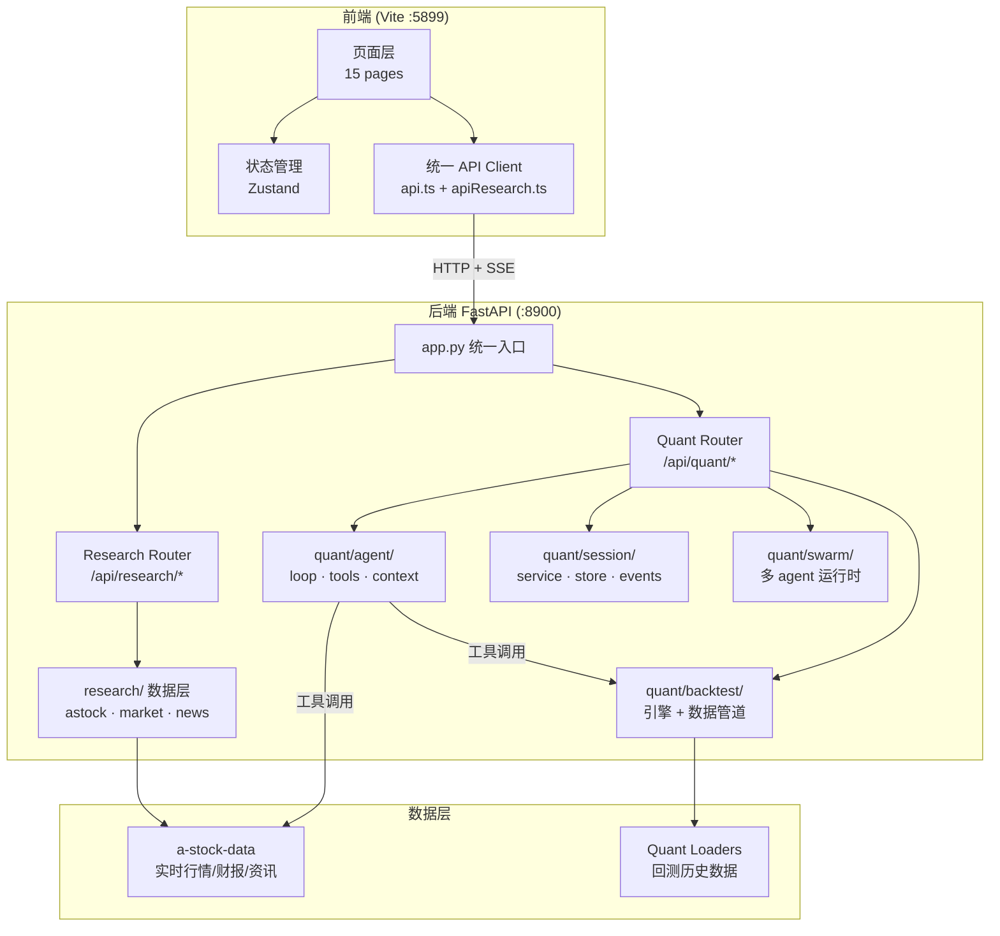
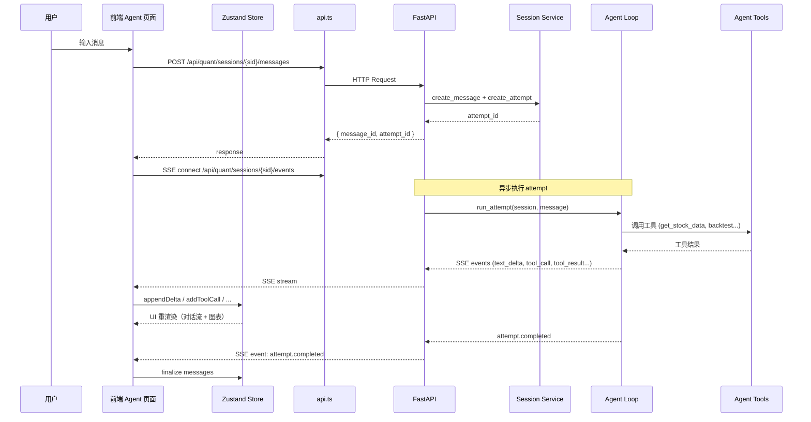

# Design Document: AlphaCopilot 前后端整合

## Overview

AlphaCopilot 需要将 Vibe-Research（投研看板）和 Vibe-Trading（量化 agent 框架）在统一架构下跑通。当前状态：后端 research 模块已可用，quant 模块路由未接入；前端 API client 以 Vibe-Trading 版本为基础但存在类型冲突。

本设计解决五个核心问题：(1) 前端 API 层合并——保留 Vibe-Trading client 的认证和 SSE 能力，追加 Research 投研接口；(2) TypeScript 编译修复；(3) 后端 quant 路由接入统一 FastAPI 入口；(4) Agent 对话核心流程端到端跑通；(5) 投研页面嵌入上下文 Agent 快捷入口。

整体约束：纯本地部署、单一 FastAPI 服务（:8900）、前端 Vite dev server（:5899）代理 `/api` 到后端。

## Architecture



## Main Data Flow: Agent 对话



## Components and Interfaces

### Component 1: 统一后端入口 (backend/app.py)

**Purpose**: 将 research 和 quant 两个模块的路由挂载到同一 FastAPI 实例，统一 CORS、认证、生命周期管理。

**Interface**:
```python
# backend/app.py — 改造后的结构
from fastapi import FastAPI

app = FastAPI(title="AlphaCopilot API", version="0.1.0")

# Research 路由保持 /api/ 前缀（兼容现有前端）
from research.app import create_research_router
app.include_router(create_research_router(), prefix="/api/research")

# Quant 路由使用 /api/quant/ 前缀
from quant.router import create_quant_router
app.include_router(create_quant_router(), prefix="/api/quant")
```

**Responsibilities**:
- 统一 CORS 配置（本地 `*`）
- 统一认证中间件（VR_API_KEY 环境变量，本地可选）
- 管理 quant 模块的 startup/shutdown 生命周期
- 路由前缀隔离，避免冲突

### Component 2: Quant 路由适配层 (backend/quant/router.py)

**Purpose**: 将 Vibe-Trading 原始 `api_server.py` 中分散注册的路由提取为 APIRouter，适配统一入口。

**Interface**:
```python
# backend/quant/router.py — 新文件
from fastapi import APIRouter

def create_quant_router() -> APIRouter:
    """创建量化模块的路由集合，不含 CORS/中间件（由 app.py 统一管理）。"""
    router = APIRouter()
    
    # Sessions (对话管理)
    from .api.sessions_routes import register_sessions_routes
    register_sessions_routes(router)
    
    # Runs (回测运行)
    from .api.runs_routes import register_runs_routes
    register_runs_routes(router)
    
    # Swarm (多 agent 协作)
    from .api.swarm_routes import register_swarm_routes
    register_swarm_routes(router)
    
    # Alpha Zoo (因子库)
    from .api.alpha_routes import register_alpha_routes
    register_alpha_routes(router)
    
    # Settings (LLM 配置)
    from .api.settings_routes import register_settings_routes
    register_settings_routes(router)
    
    # Auth (SSE ticket)
    from .api.auth_routes import register_auth_routes
    register_auth_routes(router)
    
    # Correlation (相关性分析)
    # 原内置于 api_server.py，需提取
    
    return router
```

**Responsibilities**:
- 将 Vibe-Trading 的路由注册函数从 `app` 改为接收 `APIRouter`
- 处理 quant 模块的 `sys.path` 适配
- 排除不需要的路由（live trading、channels 等，见 ADR-0003）

### Component 3: 前端统一 API Client

**Purpose**: 合并 Vibe-Trading API client（认证 + SSE）与 Research 投研接口为统一入口。

**Interface**:
```typescript
// frontend/src/lib/api.ts — 保持不变，仅调整 BASE 路径
// Quant 接口路径变为 /api/quant/...

// frontend/src/lib/apiResearch.ts — 新文件，投研接口
export const researchApi = {
  // 市场总览
  getMarketOverview: () => request<MarketOverview>("/api/research/market/overview"),
  getMarketEmotion: () => request<MarketEmotion>("/api/research/market/emotion"),
  getGlobalIndices: () => request<GlobalIndex[]>("/api/research/global/indices"),
  getIndices: () => request<IndexQuote[]>("/api/research/indices"),
  
  // 个股数据
  getQuote: (codes: string) => request<StockQuote[]>(`/api/research/quote?codes=${codes}`),
  getKline: (code: string, category?: number, offset?: number) => ...,
  getFinancials: (code: string) => ...,
  getValuation: (code: string) => ...,
  getValuationPercentile: (code: string) => ...,
  
  // 资讯
  getRadar: () => request<RadarData>("/api/research/radar"),
  getNews: (code: string, limit?: number) => ...,
  
  // 持仓
  getPortfolio: () => request<PortfolioData>("/api/research/portfolio"),
  addHolding: (code: string, shares: number, cost: number) => ...,
  
  // 研报
  listMyReports: () => request<Report[]>("/api/research/myreports"),
  
  // AI 对话（投研页面用，轻量级 NDJSON streaming）
  chat: (messages: ChatMessage[], context: string, llm: LLMConfig) => ...,
};
```

**Responsibilities**:
- 投研接口走 `/api/research/` 前缀
- 量化接口走 `/api/quant/` 前缀（现有 `api.ts` 内的路径加前缀）
- 共享 `authHeaders()` 和 `withAuthTicket()` 认证逻辑
- SSE 连接仍走 `withAuthTicket` 机制

### Component 4: 上下文 Agent 快捷入口 (ContextualAgentEntry)

**Purpose**: 在投研页面提供快捷按钮，预填当前页面上下文后跳转到 Agent 对话页面。

**Interface**:
```typescript
// frontend/src/components/common/ContextualAgentEntry.tsx
interface ContextualAgentEntryProps {
  /** 预填到 Agent 输入框的提示词模板 */
  prompt: string;
  /** 提示词中的上下文变量 */
  context?: Record<string, string>;
  /** 按钮标签（默认"问 Agent"） */
  label?: string;
}

export function ContextualAgentEntry({ prompt, context, label }: ContextualAgentEntryProps): JSX.Element;

// 使用示例（个股数据页）
<ContextualAgentEntry
  prompt="分析 {code} 的技术面和基本面，给出投研观点"
  context={{ code: currentStockCode }}
/>
```

**Responsibilities**:
- 拼装预填 prompt（替换 `{variable}` 占位符）
- 跳转到 `/agent?prefill=...` 带 URL 参数
- Agent 页面读取 `prefill` 参数填入输入框

## Data Models

### Research API 类型 (frontend/src/types/research.ts)

```typescript
// frontend/src/types/research.ts — 新文件

export interface StockQuote {
  code: string;
  name: string;
  price: number;
  change: number;
  changePercent: number;
  volume: number;
  turnover: number;
  pe: number;
  pb: number;
  marketCap: number;
  high: number;
  low: number;
  open: number;
  prevClose: number;
}

export interface MarketOverview {
  indices: IndexQuote[];
  sectorFlow: SectorFlowItem[];
  emotion: MarketEmotion;
}

export interface IndexQuote {
  code: string;
  name: string;
  price: number;
  change: number;
  changePercent: number;
}

export interface MarketEmotion {
  limitUp: number;
  limitDown: number;
  maxConsecutive: number;
  sealRate: number;
  failRate: number;
  ladder: LadderStock[];
}

export interface LadderStock {
  code: string;
  name: string;
  consecutive: number;
}

export interface KlineBar {
  time: string;
  open: number;
  high: number;
  low: number;
  close: number;
  volume: number;
}

export interface RadarData {
  tracks: RadarTrack[];
}

export interface RadarTrack {
  name: string;
  items: RadarItem[];
}

export interface RadarItem {
  title: string;
  url: string;
  source: string;
  time: string;
  summary?: string;
}

export interface ChatMessage {
  role: "user" | "assistant";
  content: string;
}

export interface LLMConfig {
  provider: string;
  baseURL: string;
  apiKey: string;
  model: string;
}
```

### 后端路由前缀映射

```typescript
// 路由前缀常量
const RESEARCH_BASE = "/api/research";  // 投研数据
const QUANT_BASE = "/api/quant";        // 量化 agent

// 前端 Vite proxy 配置 (vite.config.ts)
// proxy: { "/api": { target: "http://127.0.0.1:8900" } }
```

## Algorithmic Pseudocode

### 后端路由整合算法

```python
# backend/app.py — 整合流程

def create_app() -> FastAPI:
    """
    创建统一 FastAPI 应用。
    
    路由映射：
      /api/research/*  → research 模块原有路由（去掉原始 /api/ 前缀后重新挂载）
      /api/quant/*     → quant 模块路由（sessions, runs, swarm, alpha, settings）
      /api/health      → 全局健康检查
    """
    app = FastAPI(title="AlphaCopilot API", version="0.1.0")
    
    # 1. CORS — 本地全开
    setup_cors(app)
    
    # 2. 可选认证中间件
    if os.environ.get("VR_API_KEY"):
        setup_auth_middleware(app)
    
    # 3. Research 路由
    # research/app.py 需要重构：从直接在 app 上注册路由改为返回 APIRouter
    sys.path.insert(0, str(Path(__file__).parent / "research"))
    from research.router import research_router
    app.include_router(research_router, prefix="/api/research")
    
    # 4. Quant 路由
    sys.path.insert(0, str(Path(__file__).parent / "quant"))
    from quant.router import quant_router
    app.include_router(quant_router, prefix="/api/quant")
    
    # 5. 全局健康检查
    @app.get("/api/health")
    def health():
        return {"ok": True, "service": "alphacopilot"}
    
    return app

app = create_app()
```

### 前端 API 路径迁移算法

```typescript
// 迁移策略：最小改动原则
// 
// 现状：api.ts 中所有路径无前缀（如 "/sessions", "/runs"）
// 目标：quant 路径加 "/api/quant" 前缀
//
// 方案：修改 api.ts 顶部的 BASE 常量

// 修改前
const BASE = "";

// 修改后
const QUANT_BASE = "/api/quant";

// 所有 quant api 调用自动带前缀：
// request<T>(`${QUANT_BASE}/sessions`) → GET /api/quant/sessions
// request<T>(`${QUANT_BASE}/runs`)     → GET /api/quant/runs

// Research API 使用独立的 RESEARCH_BASE
const RESEARCH_BASE = "/api/research";
```

### Agent 对话端到端流程

```python
# 后端 Agent 对话处理流程
#
# 入口：POST /api/quant/sessions/{sid}/messages
# 响应：{ message_id, attempt_id }
# 实时事件：SSE /api/quant/sessions/{sid}/events

async def handle_send_message(sid: str, content: str):
    """
    Preconditions:
      - sid 对应的 session 存在
      - content 非空
    
    Postconditions:
      - 消息持久化到 session store
      - 创建 attempt 并开始异步执行
      - SSE 通道推送执行过程事件
    """
    session = session_service.get_session(sid)
    message = session_service.add_message(sid, role="user", content=content)
    attempt = session_service.create_attempt(sid, message.message_id)
    
    # 异步启动 agent loop
    asyncio.create_task(run_attempt(session, attempt, message))
    
    return {"message_id": message.message_id, "attempt_id": attempt.attempt_id}


async def run_attempt(session, attempt, message):
    """
    Agent loop 执行一次 attempt。
    
    Loop Invariant: 
      - 每次迭代要么产生 text_delta 事件，要么产生 tool_call 事件
      - 最终以 attempt.completed 或 attempt.failed 终止
    """
    try:
        emit_sse(session.id, "attempt.started", {})
        
        # Agent 执行（可能多轮 tool call）
        async for event in agent_loop.run(session, message):
            emit_sse(session.id, event.type, event.data)
        
        # 完成
        summary = agent_loop.get_final_response()
        session_service.add_message(session.id, role="assistant", content=summary)
        emit_sse(session.id, "attempt.completed", {"summary": summary})
        
    except Exception as e:
        emit_sse(session.id, "attempt.failed", {"error": str(e)})
```

## Key Functions with Formal Specifications

### Function 1: create_quant_router()

```python
def create_quant_router() -> APIRouter:
    """创建 quant 模块路由集合。"""
```

**Preconditions:**
- `sys.path` 已包含 `backend/quant/` 目录
- quant 子模块的依赖（`src.api.*`）可正常导入

**Postconditions:**
- 返回的 APIRouter 包含所有量化功能端点
- 不包含 live trading / channels 路由（ADR-0003 排除项）
- 路由无 prefix（由调用方设置 `/api/quant`）

### Function 2: migrateApiPaths()

```typescript
// 前端 API 路径迁移
function migrateApiPaths(): void
```

**Preconditions:**
- 现有 `api.ts` 中所有路径以 `/` 开头（如 `/sessions`, `/runs`）
- Vite proxy 配置 `/api` → `http://127.0.0.1:8900`

**Postconditions:**
- Quant 接口路径全部变为 `/api/quant/...`
- Research 接口路径全部变为 `/api/research/...`
- SSE URL 同步更新
- TypeScript 编译通过（无 import 断裂）

### Function 3: ContextualAgentEntry 跳转逻辑

```typescript
function navigateToAgent(prompt: string, context: Record<string, string>): void
```

**Preconditions:**
- `prompt` 为非空字符串，可含 `{key}` 占位符
- `context` 中的 key 匹配 prompt 中的占位符

**Postconditions:**
- 拼装后的完整 prompt 通过 URL searchParams 传递
- Agent 页面能从 `searchParams.get("prefill")` 读取并填入输入框
- 不自动发送（用户需手动确认后发送）

## Example Usage

### 后端启动

```bash
# 统一启动后端
cd backend && python -m uvicorn app:app --host 127.0.0.1 --port 8900 --reload
```

### 前端 API 调用示例

```typescript
import { api } from "@/lib/api";
import { researchApi } from "@/lib/apiResearch";

// 量化接口（带认证 + SSE）
const sessions = await api.listSessions();
const result = await api.sendMessage(sessionId, "分析贵州茅台");
const sseUrl = api.sseUrl(sessionId, { replay: "active" });

// 投研接口
const overview = await researchApi.getMarketOverview();
const quote = await researchApi.getQuote("600519");
const kline = await researchApi.getKline("600519", 4, 120);
```

### 上下文快捷入口使用

```tsx
// 个股数据页面中
import { ContextualAgentEntry } from "@/components/common/ContextualAgentEntry";

function StockData() {
  const [code, setCode] = useState("600519");
  
  return (
    <div>
      {/* 股票数据展示... */}
      <ContextualAgentEntry
        prompt="帮我分析 {code} 的近期走势，结合成交量和资金流向给出技术面观点"
        context={{ code }}
        label="AI 分析"
      />
    </div>
  );
}
```

## Correctness Properties

*A property is a characteristic or behavior that should hold true across all valid executions of a system — essentially, a formal statement about what the system should do. Properties serve as the bridge between human-readable specifications and machine-verifiable correctness guarantees.*

### Property 1: Route Isolation

*For any* HTTP request whose path starts with `/api/research/`, the request SHALL be handled exclusively by Research_Router handlers; and *for any* request whose path starts with `/api/quant/`, the request SHALL be handled exclusively by Quant_Router handlers. No request shall trigger handlers from both modules.

**Validates: Requirements 1.2, 1.3**

### Property 2: Authentication Consistency

*For any* request to either `/api/research/*` or `/api/quant/*`, when `VR_API_KEY` is configured, the authentication decision (accept or reject) SHALL be identical regardless of which module handles the request. Both modules share the same auth policy — it is never the case that one module accepts a request while the other would reject the same credentials.

**Validates: Requirements 2.2, 2.4**

### Property 3: API Path Prefix Correctness

*For any* request function exported by the quant API client, the constructed URL SHALL start with `/api/quant`; and *for any* request function exported by the research API client, the constructed URL SHALL start with `/api/research`.

**Validates: Requirements 4.1**

### Property 4: Message Persistence on Send

*For any* valid (non-empty) message content sent to an existing session, the Session_Service SHALL persist the message and return a unique message_id and attempt_id. The persisted message SHALL be retrievable by its message_id.

**Validates: Requirements 5.1**

### Property 5: SSE Event Well-formedness

*For any* attempt execution, every event emitted through the SSE_Channel SHALL have a type from the known set (`text_delta`, `tool_call`, `tool_result`, `attempt.started`, `attempt.completed`, `attempt.failed`). The event sequence SHALL always begin with `attempt.started` and terminate with exactly one of `attempt.completed` or `attempt.failed`.

**Validates: Requirements 5.2, 5.3, 5.4**

### Property 6: Empty Message Rejection

*For any* message content that is empty or consists solely of whitespace characters, the Session_Service SHALL reject the request with HTTP 400 and the session state SHALL remain unchanged.

**Validates: Requirements 5.5**

### Property 7: SSE Session Event Isolation

*For any* two concurrent sessions A and B, events delivered on session A's SSE channel SHALL contain only events belonging to session A. No event from session B shall appear on session A's channel, and vice versa.

**Validates: Requirements 6.2**

### Property 8: SSE Replay Completeness

*For any* sequence of events emitted during an active attempt, reconnecting to the SSE channel with `replay=active` SHALL deliver all previously emitted events for that attempt in their original order.

**Validates: Requirements 6.1**

### Property 9: Context Placeholder Resolution

*For any* prompt template string and context object, the Contextual_Agent_Entry's resolution function SHALL replace every `{key}` placeholder that has a matching key in the context object with its value, and remove any `{key}` placeholder that has no matching key. The resolved result SHALL contain no remaining `{...}` patterns.

**Validates: Requirements 7.1, 7.4**

### Property 10: Prefill URL Encoding Round-trip

*For any* resolved prompt string (including special characters, Unicode, whitespace), encoding it as a `prefill` URL search parameter and then decoding it on the Agent page SHALL produce the original prompt string without data loss.

**Validates: Requirements 7.2**

## Error Handling

### Error Scenario 1: Quant 模块导入失败

**Condition**: quant 依赖（如 LLM provider SDK）未安装，`import` 抛 `ModuleNotFoundError`
**Response**: `create_quant_router()` catch 异常，注册 fallback 路由返回 503 + 缺失依赖提示
**Recovery**: 用户按提示安装依赖后重启后端

### Error Scenario 2: SSE 连接中断

**Condition**: 网络波动或后端重启导致 EventSource 断开
**Response**: 前端 `useSSE` 自动重连（指数退避），UI 显示 "重连中..." 状态
**Recovery**: 重连成功后以 `replay=active` 参数恢复当前 attempt 的事件流

### Error Scenario 3: TypeScript 类型冲突

**Condition**: quant 和 research 的类型定义有同名但不兼容的接口
**Response**: 按模块分文件隔离（`types/agent.ts` + `types/research.ts`），冲突类型加命名前缀
**Recovery**: 编译时报错，通过类型文件分离解决

### Error Scenario 4: Research 页面调用 Agent 时 quant 未就绪

**Condition**: 用户点击上下文快捷入口但 quant 后端未配置 LLM
**Response**: Agent 页面正常加载，发送消息后后端返回 4xx 错误，前端 toast 提示 "请先在设置中配置 AI 接入"
**Recovery**: 用户进入 `/settings` 页面配置 LLM provider

## Testing Strategy

### Unit Testing Approach

- 后端：`pytest` 测试每个路由模块（research router、quant router 独立测试）
- 前端：`vitest` 测试 API client 函数（mock fetch）、store 状态变更、类型兼容性

### Integration Testing Approach

- 后端集成测试：`httpx.AsyncClient` 对 `app` 实例发请求，验证路由前缀正确分发
- 端到端冒烟测试：启动后端 → 前端 `fetch("/api/health")` 验证联通 → `fetch("/api/research/indices")` 验证投研 → `fetch("/api/quant/sessions")` 验证量化

### Property-Based Testing Approach

- 路由前缀不冲突属性：生成任意 path，验证不存在同时匹配 research 和 quant 前缀的路由
- SSE 事件序列属性：任意合法事件序列，store 状态始终一致（不出现 orphan toolCall）

**Property Test Library**: hypothesis (Python), fast-check (TypeScript)

## Performance Considerations

- 两个模块路由注册在同一进程，共享事件循环，无跨进程通信开销
- Research 数据层有内存缓存（5-30 分钟 TTL），不因合并而失效
- Agent 对话 SSE 为单连接长轮询，不产生额外 WebSocket 开销
- 前端 API client 拆分为两个文件但运行时共享同一 `fetch` 实例，无重复开销

## Security Considerations

- 统一认证：`VR_API_KEY` 环境变量同时保护 research 和 quant 路由
- 本地免认证：当未设置 `VR_API_KEY` 且请求来自 loopback（127.0.0.1）时免认证
- SSE ticket 机制保持不变：单次使用、短有效期、防止 URL 泄露 API key
- 不暴露 live trading / channels 路由（已排除），减少攻击面

## Dependencies

**后端**:
- FastAPI + Uvicorn（已有）
- research 模块依赖：requests, akshare(optional), mootdx(optional)
- quant 模块依赖：litellm/openai（LLM 调用）, pandas, numpy

**前端**:
- React 19 + TypeScript（已有）
- Vite（已有）
- zustand（状态管理，已有）
- lucide-react（图标，已有）
- recharts / echarts（图表渲染，已有）
