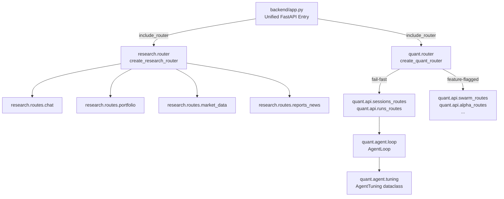
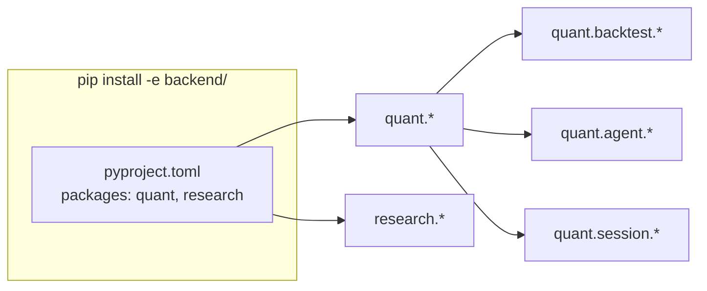

# Design Document: Architecture Deepening

## Overview

This design eliminates five structural debt categories in AlphaCopilot's unified backend:

1. **Triple entry points** — Three files (`backend/app.py`, `research/app.py`, `quant/api_server.py`) each instantiate a `FastAPI()` with their own middleware. After refactoring, only `backend/app.py` owns the application lifecycle.
2. **Ghost import prefix** — The quant module uses `from src.*` imports that resolve only via `sys.path.insert(0, quant_dir)`. After refactoring, a `pyproject.toml` declares `quant` as a proper installable package.
3. **Research router monolith** — A single ~400-line `create_research_router()` function. After refactoring, four focused sub-modules with injectable caches.
4. **Quant router silent degradation** — Every route group wrapped in try/except with a catch-all 503 fallback. After refactoring, core deps fail-fast, optional deps are feature-flagged.
5. **AgentLoop config coupling** — Five module-level `_override()` accessor functions. After refactoring, a single frozen `AgentTuning` dataclass injected at construction.

The changes are internal restructuring — no HTTP API paths change, no new user-facing behavior is added.

## Architecture

### High-Level Module Dependency (After)



### Package Install Model



After `pip install -e .` from `backend/`, all imports resolve via standard Python package machinery. No `sys.path` manipulation required.

## Components and Interfaces

### Component 1: Unified App (backend/app.py)

**Responsibility**: Single `FastAPI()` instance, owns all middleware, CORS, auth, lifecycle hooks.

**Key changes**:
- Remove the `try/except` wrapper around quant router inclusion (no fallback router)
- Remove `sys.path.insert` for research directory (rely on installed package)
- Import quant startup hooks via `quant.*` paths

```python
# backend/app.py — after refactoring (simplified)
def create_app() -> FastAPI:
    app = FastAPI(title="AlphaCopilot API", version="0.2.0")
    
    # Single CORS registration
    app.add_middleware(CORSMiddleware, ...)
    
    # Single auth middleware
    @app.middleware("http")
    async def _auth_middleware(request, call_next): ...
    
    # Research router — no sys.path hack
    from research.router import create_research_router
    app.include_router(create_research_router(), prefix="/api/research")
    
    # Quant router — fail-fast, no fallback
    from quant.router import create_quant_router
    app.include_router(create_quant_router(), prefix="/api/quant")
    
    return app
```

### Component 2: Research Router Split (backend/research/)

**Current state**: `create_research_router()` defines ~30 endpoints inline in one function.

**After state**: Four sub-modules, each with a `register_<name>_routes(router, *, caches=None)` function.

```
backend/research/
├── router.py              # create_research_router() — assembler only
├── routes/
│   ├── __init__.py
│   ├── chat.py            # /chat
│   ├── portfolio.py       # /portfolio, /portfolio/holding, /portfolio/close, etc.
│   ├── market_data.py     # /indices, /quote, /kline, /market/*, /global/*, A-stock data endpoints
│   └── reports_news.py    # /myreports, /radar, /news, /reports, /announcements
├── caches.py              # ResearchCaches dataclass (injectable cache container)
└── ... (existing modules unchanged)
```

**Interface**:

```python
# research/caches.py
@dataclass
class ResearchCaches:
    """Injectable cache container for research route handlers."""
    pct_cache: dict = field(default_factory=dict)
    ann_cache: dict = field(default_factory=dict)
    fin_cache: dict = field(default_factory=dict)
    dc_cache: dict = field(default_factory=dict)

# research/routes/market_data.py
def register_market_data_routes(router: APIRouter, *, caches: ResearchCaches) -> None:
    """Attach market data endpoints to the given router."""
    ...

# research/router.py
def create_research_router(*, caches: ResearchCaches | None = None) -> APIRouter:
    """Assemble the complete research router from sub-modules."""
    router = APIRouter()
    _caches = caches or ResearchCaches()
    
    register_chat_routes(router, caches=_caches)
    register_portfolio_routes(router, caches=_caches)
    register_market_data_routes(router, caches=_caches)
    register_reports_news_routes(router, caches=_caches)
    
    return router
```

**Route grouping**:

| Sub-module | Endpoints |
|---|---|
| `chat` | `/chat` |
| `portfolio` | `/portfolio`, `/portfolio/holding`, `/portfolio/close`, `/portfolio/refresh` |
| `market_data` | `/indices`, `/quote`, `/valuation/percentile`, `/kline`, `/finance`, `/valuation`, `/info`, `/disclosure`, `/market/overview`, `/market/emotion`, `/market/turnover-top`, `/global/indices`, `/global/stock`, `/margin`, `/block-trade`, `/holders`, `/dividend`, `/fund-flow`, `/dragon-tiger`, `/lockup`, `/blocks`, `/hot-concepts`, `/investor-qa`, `/industry` |
| `reports_news` | `/myreports`, `/myreports/file/{rid}`, `/myreports/{rid}`, `/radar`, `/radar/refresh`, `/news`, `/reports`, `/announcements`, `/financials` |

### Component 3: Quant Router Fail-Fast (backend/quant/router.py)

**Current state**: Each route group wrapped in `try/except`, catch-all `/{path:path}` registered when anything fails.

**After state**: Core deps imported at module level (fail-fast), optional deps gated by feature flags.

```python
# quant/router.py — after refactoring
import os
import logging
from fastapi import APIRouter

logger = logging.getLogger(__name__)

# Core vs optional classification
CORE_ROUTE_MODULES = ["sessions_routes", "runs_routes"]
OPTIONAL_ROUTE_MODULES = {
    "swarm_routes": "QUANT_ENABLE_SWARM",
    "alpha_routes": "QUANT_ENABLE_ALPHA_ZOO",
    "scheduled_routes": "QUANT_ENABLE_SCHEDULER",
    "channels_routes": "QUANT_ENABLE_CHANNELS",
    "live_routes": "QUANT_ENABLE_LIVE_TRADING",
}


def create_quant_router() -> APIRouter:
    """Create quant router with fail-fast for core deps, feature-flagged optional deps."""
    router = APIRouter()
    
    # Core deps — fail loudly (no try/except)
    from quant.api.sessions_routes import register_sessions_routes
    from quant.api.runs_routes import register_runs_routes
    register_sessions_routes(router)
    register_runs_routes(router)
    
    # Always-on non-core routes
    from quant.api.settings_routes import register_settings_routes
    from quant.api.auth_routes import register_auth_routes
    from quant.api.system_routes import register_system_routes
    register_settings_routes(router)
    register_auth_routes(router)
    register_system_routes(router)
    
    # Optional deps — feature-flag gated
    for module_name, flag_var in OPTIONAL_ROUTE_MODULES.items():
        if os.environ.get(flag_var, "1") == "0":
            logger.info("Quant route group %s disabled by %s=0", module_name, flag_var)
            continue
        try:
            mod = __import__(f"quant.api.{module_name}", fromlist=["register"])
            register_fn = getattr(mod, f"register_{module_name}")
            register_fn(router)
        except (ImportError, ModuleNotFoundError) as e:
            logger.warning("Optional quant route group %s unavailable: %s", module_name, e)
    
    # NO catch-all fallback
    return router
```

### Component 4: Import Path Migration (Ghost Prefix Elimination)

**Current mapping** (`sys.path.insert(0, quant_dir)` makes `quant/` the root):

| Ghost import | Real file path | New import |
|---|---|---|
| `from src.agent.loop` | `quant/agent/loop.py` | `from quant.agent.loop` |
| `from src.config.accessor` | `quant/config/accessor.py` | `from quant.config.accessor` |
| `from src.providers.chat` | `quant/providers/chat.py` | `from quant.providers.chat` |
| `from src.tools.*` | `quant/tools/*.py` | `from quant.tools.*` |
| `from backtest.loaders.*` | `quant/backtest/loaders/*.py` | `from quant.backtest.loaders.*` |
| `from src.api.*` | `quant/api/*.py` (to be created from route files) | `from quant.api.*` |

**Note**: The existing `quant/` directory IS the `src` — there is no physical `src/` directory. The alias exists purely because `sys.path` points into `quant/` making its subdirectories importable as top-level packages.

**pyproject.toml** (at `backend/pyproject.toml`):

```toml
[project]
name = "alphacopilot-backend"
version = "0.2.0"
requires-python = ">=3.11"

[tool.setuptools.packages.find]
where = ["."]
include = ["quant*", "research*"]

[tool.setuptools.package-data]
"*" = ["*.json", "*.yaml", "*.toml", "*.md"]
```

After `pip install -e .` from `backend/`, both `import quant` and `import research` resolve via standard packaging.

### Component 5: AgentTuning Dataclass (backend/quant/agent/tuning.py)

**Current state** (in `loop.py`):
```python
def _override(name: str):
    mod = sys.modules.get(__name__)
    if mod is not None and name in mod.__dict__:
        return mod.__dict__[name]
    return None

def _token_threshold() -> int:
    ov = _override("TOKEN_THRESHOLD")
    if ov is not None: return ov
    from src.config.accessor import get_env_config
    return get_env_config().agent_tuning.token_threshold
# ... 5 more similar functions
```

**After state** (new file `quant/agent/tuning.py`):

```python
# quant/agent/tuning.py
from __future__ import annotations
from dataclasses import dataclass


@dataclass(frozen=True)
class AgentTuning:
    """Immutable tuning parameters for the AgentLoop.
    
    All values are read once at construction. Tests inject custom instances
    rather than monkeypatching module globals.
    """
    token_threshold: int
    heartbeat_interval_s: float
    reasoning_delta_min_interval_s: float
    stream_retry_delay_s: float
    tool_timeout_seconds: float
    goal_max_continuations: int

    @classmethod
    def from_env_config(cls) -> AgentTuning:
        """Construct from the current environment configuration."""
        from quant.config.accessor import get_env_config
        cfg = get_env_config().agent_tuning
        return cls(
            token_threshold=cfg.token_threshold,
            heartbeat_interval_s=cfg.vt_heartbeat_interval_s,
            reasoning_delta_min_interval_s=cfg.vt_reasoning_delta_min_interval_s,
            stream_retry_delay_s=cfg.vt_stream_retry_delay_s,
            tool_timeout_seconds=cfg.vibe_trading_tool_timeout_seconds,
            goal_max_continuations=cfg.vibe_trading_goal_max_continuations,
        )
```

**AgentLoop constructor change**:

```python
# quant/agent/loop.py — constructor signature after refactoring
class AgentLoop:
    def __init__(
        self,
        *,
        tuning: AgentTuning,
        tool_registry: ToolRegistry,
        llm: ChatLLM,
        context_builder: ContextBuilder,
        workspace_memory: WorkspaceMemory | None = None,
        # ... other existing params
    ):
        self._tuning = tuning
        # ...
    
    # Usage throughout the class:
    # Before: if estimate_tokens(messages) > _token_threshold(): ...
    # After:  if estimate_tokens(messages) > self._tuning.token_threshold: ...
```

### Component 6: Deprecated Entry Points

**research/app.py** — becomes a thin redirect:

```python
# research/app.py
"""DEPRECATED: Use backend/app.py as the unified entry point.

This file exists only for backwards compatibility. It prints a deprecation
warning and exits.
"""
import sys

def _main():
    print(
        "⚠️  research/app.py is deprecated. Use the unified entry point:\n"
        "    cd backend && python -m uvicorn app:app --port 8900\n",
        file=sys.stderr,
    )
    raise SystemExit(1)

if __name__ == "__main__":
    _main()
```

**quant/api_server.py** — keeps `serve_main()` for CLI compatibility but removes the standalone `app = FastAPI(...)`:

```python
# quant/api_server.py — after refactoring
"""DEPRECATED standalone server. Route modules re-exported for compatibility.

The FastAPI application is no longer instantiated here. Use backend/app.py.
CLI entry via `vt serve` delegates to the unified app.
"""
import sys

# Re-exports for test compatibility remain until tests are migrated
# ...

if __name__ == "__main__":
    print(
        "⚠️  quant/api_server.py is deprecated. Use the unified entry point:\n"
        "    cd backend && python -m uvicorn app:app --port 8900\n",
        file=sys.stderr,
    )
    raise SystemExit(1)
```

## Data Models

### AgentTuning Dataclass

| Field | Type | Source (from env config) |
|---|---|---|
| `token_threshold` | `int` | `agent_tuning.token_threshold` |
| `heartbeat_interval_s` | `float` | `agent_tuning.vt_heartbeat_interval_s` |
| `reasoning_delta_min_interval_s` | `float` | `agent_tuning.vt_reasoning_delta_min_interval_s` |
| `stream_retry_delay_s` | `float` | `agent_tuning.vt_stream_retry_delay_s` |
| `tool_timeout_seconds` | `float` | `agent_tuning.vibe_trading_tool_timeout_seconds` |
| `goal_max_continuations` | `int` | `agent_tuning.vibe_trading_goal_max_continuations` |

Frozen (`@dataclass(frozen=True)`) — immutable after construction. Tests construct directly with custom values.

### ResearchCaches Dataclass

| Field | Type | Default |
|---|---|---|
| `pct_cache` | `dict` | `{}` |
| `ann_cache` | `dict` | `{}` |
| `fin_cache` | `dict` | `{}` |
| `dc_cache` | `dict` | `{}` |

Mutable (caches accumulate entries at runtime), but injectable (tests pass their own instance).

## Correctness Properties

*A property is a characteristic or behavior that should hold true across all valid executions of a system — essentially, a formal statement about what the system should do. Properties serve as the bridge between human-readable specifications and machine-verifiable correctness guarantees.*

### Property 1: Research route set preservation

*For any* research router produced by `create_research_router()` after the split, the set of `(method, path)` tuples registered on the router SHALL be identical to the set registered by the pre-refactoring monolithic implementation.

**Validates: Requirements 3.4**

### Property 2: Cache isolation via injection

*For any* research route handler that accesses a cache, if a custom `ResearchCaches` instance is injected via `create_research_router(caches=custom)`, then all cache reads and writes performed by that handler SHALL use the injected instance and SHALL NOT touch any module-level global.

**Validates: Requirements 3.5, 3.6**

### Property 3: Core dependency fail-fast

*For any* core route module (sessions, runs), if that module is unimportable at startup, calling `create_quant_router()` SHALL raise `ImportError` and SHALL NOT return a router.

**Validates: Requirements 4.1**

### Property 4: No catch-all route regardless of optional dep availability

*For any* subset of optional route modules that are unavailable (import fails or feature flag disabled), the router returned by `create_quant_router()` SHALL NOT contain a route matching the pattern `/{path:path}`.

**Validates: Requirements 4.2, 4.3**

### Property 5: Feature flag prevents import attempt

*For any* optional route group controlled by a feature flag, if the flag is set to `"0"`, then `create_quant_router()` SHALL NOT attempt to import that route module.

**Validates: Requirements 4.5**

### Property 6: Deterministic route set for a given configuration

*For any* fixed combination of available dependencies and feature flag values, calling `create_quant_router()` multiple times SHALL produce routers with identical `(method, path)` route sets.

**Validates: Requirements 4.6**

### Property 7: AgentTuning injection respected by AgentLoop

*For any* `AgentTuning` instance with arbitrary valid field values, an `AgentLoop` constructed with that instance SHALL use exactly those field values for all tuning decisions (token threshold checks, heartbeat intervals, retry delays, timeouts, continuation limits) — never falling back to environment config or module-level accessors.

**Validates: Requirements 5.3, 5.4, 5.7**

## Error Handling

| Scenario | Behavior |
|---|---|
| Core quant dep missing at startup | `ImportError` propagates → app fails to start with clear traceback |
| Optional quant dep missing | Warning logged with dep name and error; route group silently omitted |
| Feature flag set to `"0"` | Route group skipped entirely (no import attempted, info-level log) |
| `python research/app.py` executed | Deprecation message to stderr, `SystemExit(1)` |
| `python quant/api_server.py` executed | Deprecation message to stderr, `SystemExit(1)` |
| `AgentTuning.from_env_config()` fails (missing config) | Exception propagates to caller — no silent defaults |
| `pip install -e .` fails (broken pyproject.toml) | Standard pip error — developer must fix config |

## Testing Strategy

### Unit Tests (example-based)

- **Entry point deprecation**: Run `research/app.py` and `quant/api_server.py` as `__main__`, assert `SystemExit(1)` and deprecation message.
- **AgentTuning construction**: Verify `from_env_config()` returns correct types, verify frozen raises on mutation.
- **Router sub-module interfaces**: Each `register_*_routes` function exists and attaches routes to a router.
- **Static checks**: No `sys.path.insert` in production code, no `from src.*` imports, no `_override()` function.

### Property Tests (fast-check / Hypothesis)

Property-based testing is appropriate here because:
- Route registration logic has universal invariants (route sets, no catch-all)
- AgentTuning injection is a universal property across all valid parameter combinations
- Cache isolation must hold for all cache operations

**Library**: `hypothesis` (already available in Python ecosystem, integrates with pytest)

**Configuration**: Minimum 100 iterations per property test.

| Property | Test approach |
|---|---|
| Property 1 (route preservation) | Generate the router, enumerate routes, compare against captured baseline set |
| Property 2 (cache isolation) | Generate random stock codes + cache entries via Hypothesis, inject custom caches, verify no global state mutation |
| Property 3 (core dep fail-fast) | Parametrize over core deps, mock as unimportable, assert ImportError |
| Property 4 (no catch-all) | Generate random subsets of optional deps as unavailable, verify no catch-all in routes |
| Property 5 (feature flag) | Generate random flag combinations, mock imports, verify import not attempted when flag="0" |
| Property 6 (deterministic routes) | Generate random dep/flag configs, call create_quant_router() twice, assert route sets equal |
| Property 7 (AgentTuning injection) | Generate random valid tuning values via Hypothesis, construct AgentLoop, verify all values respected |

**Tag format**: `# Feature: architecture-deepening, Property {N}: {title}`

### Integration Tests

- Full app startup with all deps available → health check passes
- Full app startup with optional deps removed → health check passes, optional routes absent
- `pip install -e .` from `backend/` → all quant and research imports resolve
- Existing test suite passes without `sys.path` hacks in conftest
